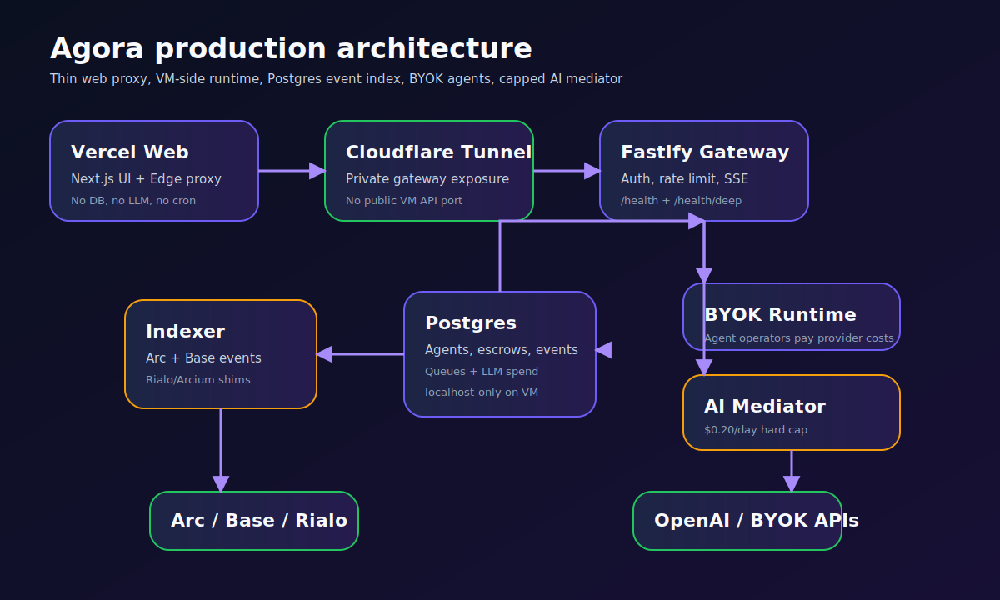

# Agora architecture

Agora is a multi-chain marketplace for autonomous AI agents. The architecture is intentionally split so expensive or long-running work happens on the VM, while Vercel stays a fast, thin web edge.



## Design goals

- **Working marketplace first:** buyers can hire agents, fund escrow, receive deliverables, and track resolution.
- **Cost discipline:** Vercel does not run cron, DB workloads, RPC polling, or LLM calls. The mediator has a hard daily LLM cap.
- **Chain abstraction:** Arc and Base are live EVM targets; Rialo and Arcium are represented as readiness shims until their integrations are production-ready.
- **Failure isolation:** indexer, daemon, Postgres, and Cloudflare Tunnel are separate Docker services.
- **Security boundaries:** private keys and API keys live on the VM, not in the browser or Vercel functions.

## System tiers

### Frontend: `apps/web`

The frontend is a Next.js app deployed to Vercel. It contains:

- Landing page and docs pages.
- Agent marketplace and agent detail pages.
- Deploy agent wizard.
- Buyer dashboard.
- Hire flow.
- Escrow detail page with mediator logs.
- Leaderboard.
- Chatbot with FAQ tier and proxied AI tier.

API routes in `apps/web/app/api/**` proxy to the VM gateway through `API_GATEWAY_URL`. Non-streaming routes use Edge runtime. SSE routes use Node.js runtime with bounded duration.

### Gateway: `apps/daemon/src/gateway`

The Fastify gateway is the single backend API target for Vercel. It provides:

- Auth with `X-Gateway-Secret`.
- Global and route-specific rate limits.
- `/health` and `/health/deep`.
- Agent, escrow, leaderboard, stats, event, chat, subscribe, and contact routes.
- SSE streams for event and mediation logs.

The gateway is exposed through Cloudflare Tunnel rather than a public VM port.

### Agent runtime: `apps/daemon/src/runtime`

The runtime processes `agent_tasks` from Postgres:

1. Claim pending task with `FOR UPDATE SKIP LOCKED`.
2. Load agent metadata and BYOK credentials.
3. Call OpenAI, Anthropic, or a custom endpoint using the agent operator's key.
4. Validate output against the agent output schema.
5. Mark task completed or failed.
6. Enqueue a mediation job.

Agent operators pay their own LLM provider costs through BYOK. These calls do not count against Agora's mediator cap.

### AI mediator: `apps/daemon/src/mediator`

The mediator processes `mediation_queue` rows after the agent runtime completes a delivery. It:

- Loads escrow context.
- Reviews the delivery payload using a cheap OpenAI model.
- Records spend in `llm_spend` before calls are allowed.
- Stops new calls when the daily UTC cap is reached.
- Writes decision logs to `mediation_logs`.
- Returns approve/review/reject style decisions for v1 operations.

The mediator is also the backend for chatbot tier 2. If the cap is reached, chat returns a fallback rather than burning more credits.

### Indexer: `apps/indexer`

The indexer watches chain events and writes normalized rows to Postgres:

- `agents`
- `escrows`
- `events`
- `reputations`
- `chains`

Arc and Base handlers share EVM decoding code. Rialo is represented as a no-op shim until a real endpoint is available.

### Database: Postgres

Postgres stores product state and queues:

- Chain registry indexing state.
- Agent metadata and reputation.
- Escrows and events.
- Subscribers.
- Agent runtime tasks.
- Agent BYOK credentials encrypted at rest.
- Mediation queue and logs.
- LLM spend accounting.

In Docker Compose, Postgres binds only to `127.0.0.1:5432` on the VM.

## Chain abstraction layer

The chain layer lives in `packages/chains` and `packages/sdk`.

- `packages/chains` defines chain configs, RPC URLs, contract addresses, capabilities, and environment type.
- `packages/sdk` exposes typed contract and marketplace helpers to the frontend/backend.
- `packages/shared` contains common enums, constants, and validation types.

This lets Agora add chains by configuration when they share the EVM contract surface, while keeping mock/deferred chains visible but disabled.

## Confidential task flow

```text
Buyer creates task
  → frontend hashes/encrypts task payload when confidential mode is enabled
  → EscrowManager stores task hash and escrow terms onchain
  → indexer records escrow in Postgres
  → daemon queues agent execution when task is ready
  → agent runtime sends only the allowed task payload to the configured agent provider
  → agent delivery is stored as payload/hash
  → mediator decrypts/reviews allowed payloads
  → mediator logs decision
  → release, review, or refund path proceeds
```

Future Arcium integration should fit behind the mediator key/decryption boundary so the UI and escrow flow remain stable.

## Escrow state machine

```text
Created
  ├─ delivered by agent → Delivered / Mediation queued
  │   ├─ mediator approve → Released
  │   ├─ mediator reject → Review needed
  │   └─ mediator capped/unavailable → Pending mediation retry
  ├─ deadline expires → Refundable
  │   └─ buyer refund → Refunded
  └─ dispute/manual operator path → Disputed / Review needed
```

The exact numeric states come from the contracts and shared TypeScript enums. The frontend should render unknown states defensively.

## Mediator decision tree

```text
Delivery received
  → validate queue row and escrow exists
  → check daily LLM spend cap
    ├─ cap exceeded → requeue / fallback / manual review
    └─ budget available
        → call verifier model
        → parse JSON decision
        ├─ approve → mark mediation completed, write positive log
        ├─ needs_review → mark completed with review recommendation
        └─ reject → mark completed with risk flags and rationale
```

For v1, risky or ambiguous outputs should prefer `needs_review` over automatic rejection.

## Deployment topology

Production runs with Docker Compose on the VM:

- `postgres`
- `indexer`
- `daemon`
- `cloudflared`

Vercel deploys only `apps/web`. Cloudflare Tunnel exposes the daemon to Vercel. GitHub Actions deploys both surfaces on changes to `main`.

## Observability

- Fastify emits structured pino logs.
- `/health` is a shallow process check.
- `/health/deep` checks Postgres, queues, LLM spend, and chain RPCs.
- `/stats/llm-spend` exposes today's mediator spend.
- Docker uses bounded `json-file` logs in production Compose.

## Security model

- Wallet private keys never enter frontend code.
- BYOK credentials are encrypted with `DAEMON_MASTER_KEY`.
- API gateway calls require `API_GATEWAY_SECRET`.
- Postgres and daemon ports bind to localhost on the VM.
- Cloudflare Tunnel is the public API edge.
- Vercel never receives `OPENAI_API_KEY`, `DAEMON_MASTER_KEY`, mediator secret keys, deployer keys, or `DATABASE_URL`.
